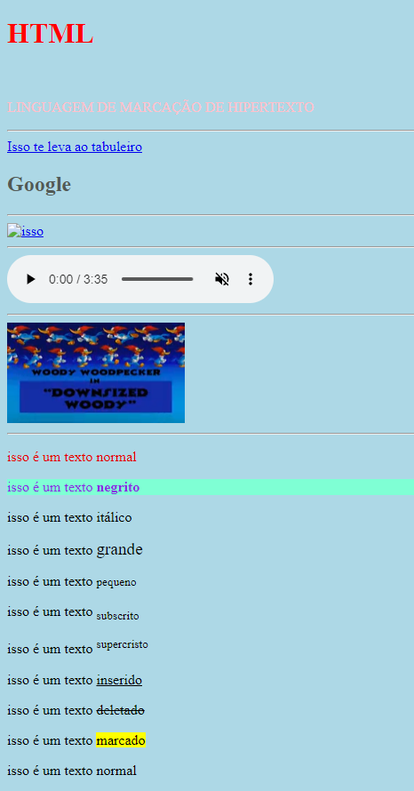

<h1 align="center"> HTML COURSE  </h1>

  <a href="#-technologies">Technologies</a>&nbsp;&nbsp;&nbsp;|&nbsp;&nbsp;&nbsp;
  <a href="#-project">Project</a>&nbsp;&nbsp;&nbsp;|&nbsp;&nbsp;&nbsp;
  <a href="#memo-license">License</a>

  

 

  

## 🚀 Topics

This project covered the following topics:

- Hyperlinks :point_left:
- Images :camera:
- Video :movie_camera:
- Lists :clipboard:
- Tables :bar_chart:
- ...

## 💻 Project

This HTML course contains a lot of information about this essential language for devs.

- [Access the finished project, online](https://smoothemerson.github.io/HTML-Course/)

- [Watch class](https://www.youtube.com/watch?v=HD13eq_Pmp8&t=3s)

## :memo: License

This project is under the MIT license.
